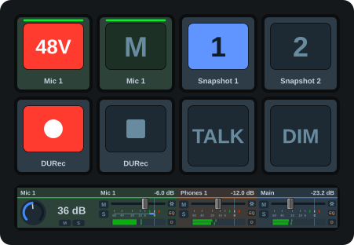
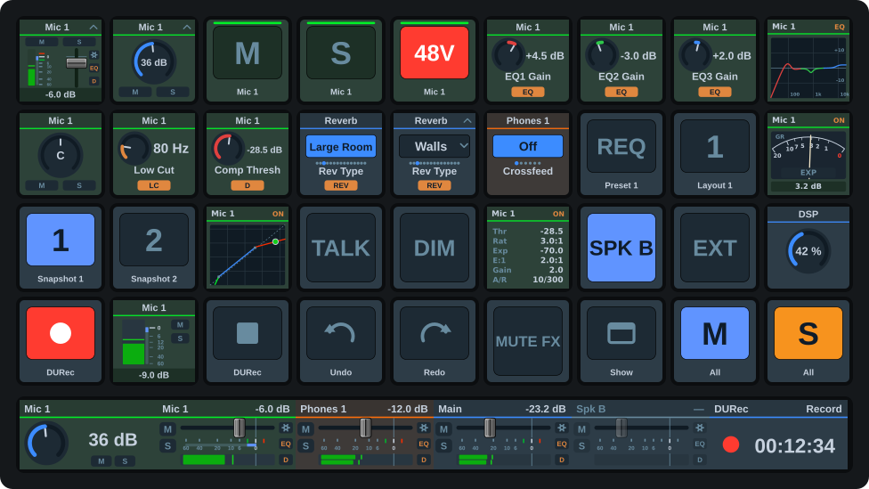

  

# TotalMix FX Control (unofficial Stream Deck plugin)

## What is this (and what does it do?)

It's a plugin for the [Elgato Stream Deck][Stream Deck] on Windows and macOS that puts [RME TotalMix FX][] on your keys and dials: faders, mute, solo, phantom power, snapshots, DURec, effects, dynamics, Room EQ and more, with everything drawn live from the mixer so the deck always shows what TotalMix is doing. Note: an RME audio interface/card is needed for TotalMix FX to work.

## What's new since v3

v5 is the first release after v3.3.5 published to the Marketplace. The v4 line (a full rewrite) was published on GitHub as an intermediate development version; v5 builds the TotalMix look on top of it. The full list is in the [changelog](https://shells-dw.github.io/streamdeck-totalmix/changelog.html).

### New in v5

- **Looks similar to TotalMix**. Every key and Stream Deck+ display is drawn live in the familiar colours, Global OSC and classic alike: fader strips with RME's scale and a peak meter, knobs with section-coloured arcs, dropdown boxes for lists, and the familiar blue M / orange S / red 48V buttons. An *Appearance* setting per button switches back to the plain icons of the previous versions.
- **Global OSC first**. The five "(TotalMix 2.1+)" actions carry the new feature set: absolute channel numbers, real state feedback, meters, snapshots that light while loaded. The classic actions for TotalMix FX 1.96–2.0 are still included and still work, but new features land on Global OSC.
- **Select instead of step**. A key can write one specific entry of a list (reverb type, reference level, crossfeed, EQ band type, low cut slope, echo type) and light while that entry is active. A second-press action of your choice means one key can be a preset, a two-way toggle or an on/off switch.
- **Channel colours**. The colour set in TotalMix's *Color (Name Field)* list is read over Global OSC and tints the artwork, so every key and dial for one channel reads as a set.
- **EQ and dynamics curves**. The Display action can draw a channel's summed EQ response over 20 Hz to 20 kHz, or its dynamics transfer curve with the current level on it. A values mode lists the dynamics numbers instead.
- **Gain reduction**. A blue bar beside the meter on Volume strips and on the Display level view, and a VU-style needle with an EXP lamp as its own Display mode. Global OSC carries no gain-reduction value, so it is computed from the peak level and the section's static curve rather than measured, and it is limited by the Stream Deck redraw rate; it is an estimate, not the value TotalMix shows.
- **More control room targets**. Speaker B, the four Phones slots and monitor balance, each following TotalMix's assignment. A Main Out dial can hand over to Speaker B while that is engaged, and Mute Main Out is available as a gesture and as a Toggle parameter.
- **More on the Display level view**. Both sides of a stereo pair are metered, with the channel's mute and PFL state alongside.
- **FX lamps on the strips**. The settings, EQ and dynamics indicators TotalMix lights beside a channel's fader, on the Global OSC Volume strip and lit by the same conditions. A key that only needs to watch EQ and dynamics no longer needs a Toggle key each. Lamps and the M/S pills can each be switched off, and the fader takes back the room.

### New since v3 (the v4 line)

- Complete rewrite in TypeScript on Elgato's Node SDK instead of C#/.NET; one persistent OSC connection, no polling, near-zero CPU. Runs on macOS; one installer for Windows and Mac.
- Stream Deck+ dials: turn to set levels, with channel name, live readout and position on the display. Press and touch are assignable per dial. Volume buttons for decks without dials, where each press nudges by a set amount.
- dB-accurate stepping that follows RME's fader curve, so every step moves the same amount anywhere on the throw.
- Live two-way feedback: change something in TotalMix and your buttons update instantly.
- Pick channels by name, "1 · Mic 1", read live from your interface.
- Input gain, pan, effects (reverb, echo, low cut, EQ, dynamics, Auto Level) and Room EQ (all 9 bands) on dials.
- Jump straight to submixes, snapshots, buses and Quick Workspaces.
- TotalMix FX 2.0 compatible (and 1.96+), with a simpler setup: one OSC controller, no config file.
- TotalMix FX 2.1 "Global OSC" support, with five additional actions (Volume, Toggle, Trigger, Display, FX & Dynamics) with absolute channel addressing: a button means "input 3", not "the third fader of whatever bank is shown". Snapshots with a real active-state light, DURec transport, layouts, presets, undo/redo, device status and DSP load.
- Defaults for new buttons: host, ports and dB-per-step set once, copied into every button you add; stored in Stream Deck, so they survive updates.

> [!NOTE]
> Global OSC requires TotalMix FX 2.1, which RME marks as beta. The protocol may change with any release.

## Release / Installation

Install it from the Elgato Marketplace inside the Stream Deck app or open the [Elgato Marketplace] in the browser. After installation it lands in Stream Deck's action list as *TotalMix FX Control*.

Requires Stream Deck 6.9 or newer on Windows 10+ or macOS 13+.

The full feature set (absolute channel numbers, snapshot and DURec state, meters that follow the channel) requires TotalMix FX 2.1 with Global OSC. The classic actions get the same TotalMix look without meters; the classic protocol only reports what the mixer window currently shows.

## Coming from v3

**Your existing buttons will not carry over.** What used to be many separate actions is now three classic actions plus five for TotalMix FX 2.1's Global OSC, so buttons must be re-added. Your settings, ports and icons are otherwise familiar.

Stream Deck treats it as a separate plugin from v3, so it **will** run alongside your existing plugin, **however** they can't both point to the same OSC controllers. v3 uses Remote Controllers 1 and 2, and so does this one, so the two collide completely. If you want both active at the same time, you must move one of them to a formerly unused OSC controller (TotalMix has four; 3 and 4 are the usual spares). Otherwise uninstall the old plugin!

MIDI support has been removed. OSC does everything the MIDI actions did and reports state back, which MIDI cannot. If you depend on MIDI, stay on v3.3.5.

The de.shells.totalmix.exe.config file is gone. Connection settings now live under Connection in each button's settings.

## Coming from a v4 pre-release

If you picked up one of the v4 builds: buttons carry over. Keys and dials switch to the TotalMix look; a button's *Appearance* setting restores the previous artwork. Meters on the fader strips need "Send Level Messages" on the Global OSC controller (see below).

## Setup for OSC

Open *Options → Settings… → OSC* in TotalMix and set up the Remote Controller for the actions you use:

| | Remote Controller | Mode | Ports incoming / outgoing |
|---|---|---|---|
| "(TotalMix 2.1+)" actions, recommended | 2 | Global OSC | 7002 / 9002 |
| Classic actions | 1 | classic | 7001 / 9001 |

Tick *In Use*, enter `127.0.0.1` as the Remote Controller Address, and for Global OSC enable *Send changes* and *Send status* under *Details*. *Send Level Messages* is optional on the Global OSC controller: on, the fader strips get meters. Leave it off on controller 1; the classic actions don't use it. Then tick *Enable OSC Control* in the Options menu and allow the firewall prompts. Different ports, a remote host, or both plugins side by side: see the [setup guide](https://shells-dw.github.io/streamdeck-totalmix/setup.html).

No additional software is needed.

## Actions

| Action | Where | What it does |
|---|---|---|
| Volume (TotalMix 2.1+) | Key or dial | Global OSC: channel fader, submix send, channel or send pan, preamp gain, or a control room monitor (Main Out, Speaker B, a Phones slot, the shared monitor path, balance), addressed by absolute channel number. Rotate to adjust; press and touch are assignable. Keys nudge up or down per press. Optional gain-reduction bar beside the meter and FX lamps beside the fader. |
| Toggle (TotalMix 2.1+) | Key | Global OSC: mute, PFL, phase (L/R), 48V, pad, instrument, AutoSet, M/S, loopback, stereo link, record, talkback destination, low cut, EQ, dynamics, Auto Level, Room EQ; control room (dim, mono, talkback, external input, speaker B, mute Main Out, mute FX return, link Main/Speaker B); global mute/solo enable; reverb, echo; mute/solo/fader groups. |
| Trigger (TotalMix 2.1+) | Key | Global OSC: load snapshots (key lights while active), layout presets, EQ/dynamics/Room EQ presets per channel and reverb/echo presets by number, undo/redo, recall, DURec transport, show/hide the TotalMix window, cue cycling, monitor-path cycling. |
| Display (TotalMix 2.1+) | Key or dial | Global OSC, read-only: device name, connection, DSP load, DURec time and state, channel peak level with clip latch and signal watch, EQ and dynamics curves, dynamics values, gain-reduction needle. Press to force a refresh or clear an alarm. |
| FX & Dynamics (TotalMix 2.1+) | Key or dial | Global OSC: reverb, echo, EQ, low cut, dynamics, Auto Level, width, crossfeed, delay, reference level and Room EQ (volume correction, delay, all 9 bands), addressed by absolute channel number. Rotate to adjust; press and touch are assignable. Keys nudge, or select one entry of a list directly. |
| Levels & Parameters (classic) | Key or dial | Main / Control Room volume, a strip in the current bank, the selected channel, pan, input preamp gain, or an FX, EQ, dynamics, Auto Level or Room EQ parameter. |
| Toggle (classic) | Key | Control room, global mute/solo enable, trim mode; per strip in the current bank: mute, solo, phantom, cue; per channel: mute, solo, phantom, EQ, low cut, dynamics, Auto Level, stereo/mono, phase, instrument, pad, M/S, AutoSet, loopback, talkback include, trim exclude, record enable; DURec; groups, snapshots, reverb, echo, Room EQ. |
| Select (classic) | Key | Jump to a submix, bank start, channel offset, bus, snapshot or Quick Workspace, or step through tracks and banks. |

The classic actions keep working and share the TotalMix look; both protocols run in parallel on separate TotalMix Remote Controllers.

## Documentation

Everything else lives in the [documentation](https://shells-dw.github.io/streamdeck-totalmix/): every action's settings, dials and gestures, the TotalMix look, device tables and troubleshooting.

- [Setup](https://shells-dw.github.io/streamdeck-totalmix/setup.html) · [Dials and gestures](https://shells-dw.github.io/streamdeck-totalmix/dials-and-gestures.html) · [Appearance](https://shells-dw.github.io/streamdeck-totalmix/appearance.html)
- Global OSC: [Volume](https://shells-dw.github.io/streamdeck-totalmix/global-osc/volume.html) · [Toggle](https://shells-dw.github.io/streamdeck-totalmix/global-osc/toggle.html) · [Trigger](https://shells-dw.github.io/streamdeck-totalmix/global-osc/trigger.html) · [Display](https://shells-dw.github.io/streamdeck-totalmix/global-osc/display.html) · [FX & Dynamics](https://shells-dw.github.io/streamdeck-totalmix/global-osc/effects.html)
- Classic: [Levels & Parameters](https://shells-dw.github.io/streamdeck-totalmix/classic/levels.html) · [Toggle](https://shells-dw.github.io/streamdeck-totalmix/classic/toggle.html) · [Select](https://shells-dw.github.io/streamdeck-totalmix/classic/select.html)
- [Devices](https://shells-dw.github.io/streamdeck-totalmix/devices.html) · [Troubleshooting](https://shells-dw.github.io/streamdeck-totalmix/troubleshooting.html) · [Changelog](https://shells-dw.github.io/streamdeck-totalmix/changelog.html)

## A recording layout example

The layout at the top of this page is a Stream Deck+ set up for a single-mic session: 48V and mute on the mic, two snapshots (say "Recording" and "Mixing"), DURec record and stop, talkback and dim; on the dials, mic gain, the mic's fader into Main, the phones level and the main out. On a Stream Deck+ XL (9 × 4 keys, six dials) there's room for the effect chain as well: EQ gains with the EQ curve, low cut, compressor threshold with the dynamics curve and gain-reduction needle, DSP load, with the six dials on levels and the DURec clock:

## I have an issue or miss a feature?

You can submit an issue or request a feature with [GitHub issues]. Please describe as precisely as possible what went wrong and include any log files, as they are incredibly helpful for figuring out what happened. Logs can be found in `%APPDATA%\Elgato\StreamDeck\Plugins\de.shells.totalmixgen2.sdPlugin\logs` on Windows and `~/Library/Application Support/com.elgato.StreamDeck/Plugins/de.shells.totalmixgen2.sdPlugin/logs` on macOS.

## Source code

The source code and precompiled plugin builds are no longer published here; this repository only hosts the documentation.

I made that decision to avoid what I see in other projects I contribute to or maintain: high-effort, low-quality AI-generated pull requests that take hours to pick apart just to find silly bugs, breaking changes or unintended side effects buried deep in the code. I know people only want to help and AI enables them to, but in the end it's me spending two hours on what a prompt produced in two minutes and then got sent to me untested. I do not intend to spend my time this way, and I'm sure you'll understand.

**The plugin will however stay free. It's free in the Elgato Marketplace and it will stay that way.**

## Feedback and device testing

If you're interested in using this plugin but something you really need is missing, let me know. I naturally don't have access to all RME devices, so I can't try things on the boxes themselves, but eventually we might find a way to work something out.

## Support

If you'd like to drop me a coffee for the hours I've spent on this:  

## Disclaimer

This is a private project, I am not affiliated with RME or Elgato. I wrote this plugin out of personal interest.

<!-- Reference Links -->

[Elgato Marketplace]: https://marketplace.elgato.com/product/totalmix-fx-control-bca82a36-06bc-45ce-8bbe-10c18befa21e "Elgato Marketplace"
[Stream Deck]: https://www.elgato.com/gaming/stream-deck/ "Elgato's Stream Deck product page"
[RME TotalMix FX]: https://www.rme-audio.de/totalmix-fx.html "RME's TotalMix FX product page"
[GitHub issues]: https://github.com/shells-dw/streamdeck-totalmix/issues "GitHub issues link"