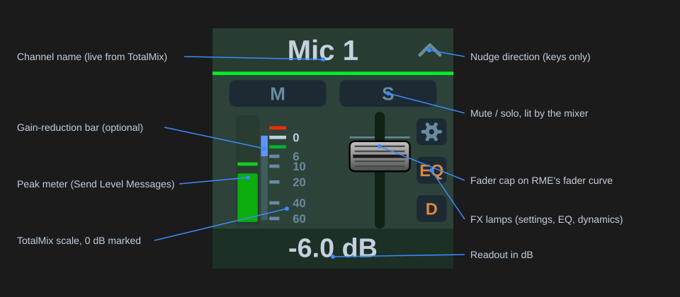
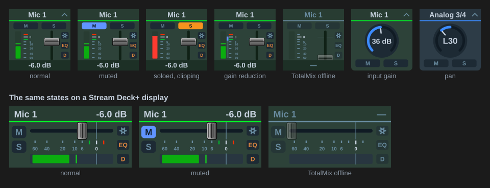
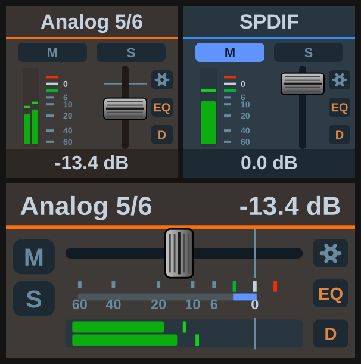
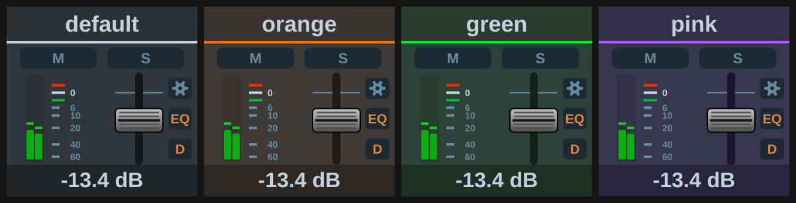

[← Documentation home](index.md)

# Appearance

Every action has an *Appearance* setting in its button settings, Global OSC and classic alike.

## TotalMix look (default)

Keys and Stream Deck+ displays are drawn by the plugin on every change, in colours and proportions taken from the mixer:

**Fader strips** for levels: channel name, M and S pills, the meter, RME's scale with 0 dB marked and the +3 and −3 ticks coloured as in the mixer, the cap on the real fader curve, and the readout in dB. *Meter*, *FX lamps* and *Mute / Solo* each switch off their own column, and the fader takes the room they leave. The classic Levels action draws no meter, because that protocol only reports levels for the visible bank.

**Knobs** for preamp gain, pan and effect parameters, the arc in the section's colour. **Dropdown boxes** for list parameters. **Buttons** for toggles and triggers: blue for mute-type switches, orange for solo, PFL and talkback, red for 48V and record, orange text for the effect sections. **Panels** for the Display action, including the EQ and dynamics curves and the gain-reduction needle.

When TotalMix is not reachable the artwork greys out and the readout shows "—". The chevron in a key's header shows which way it nudges.

### Meters

Peak level with a hold line, held for 1.5 s and then falling at 12 dB/s; clipping turns the bar red. A stereo pair meters both sides, a mono channel one. With *Gain reduction* ticked, a blue bar beside the meter grows down from the 0 dB mark by the compressor's reduction, continued in green by the expander.

On a Stream Deck+ display the meter shares the fader's own range and dB mapping, so a level reads directly against the scale below the fader. M and S stack in a column at the left, the FX lamps at the right.

### Channel colours

Global OSC reports the colour set in TotalMix's *Color (Name Field)* list, and every channel-scoped key and dial takes it, so all the buttons for one channel read as a set. The body, header, readout band and fader track are tinted, and the header rule is painted in the colour's own ink. A channel with no colour set keeps the plugin's default tones.

A toggle key's face keeps its function's colour rather than the channel's, since the face is what tells you what the button does; the channel colour shows in the key's body and in a bar across the top edge. On the EQ and dynamics panels the plot keeps its dark well, because the curve is read against that field. Parameters with no channel behind them — control room, global toggles, reverb and echo, snapshots, layouts, the transport — keep the default tones.

Channels hidden in TotalMix's channel layout are left out of the channel lists in a button's settings.

## Icon look

The previous artwork: a static icon per parameter with the value as the key title. On dials, name, value and a position bar on a black display that washes blue for mute and orange for solo; an effect dial shows orange text while its section is on.

## Custom images and titles

A custom image or title set in Stream Deck's own key settings always wins over whatever the plugin draws. That's the way to give a key your own icon while keeping its behaviour.

## Display action

Its Appearance options are "TotalMix panel" and "Plain title". See [Display](global-osc/display.md).
