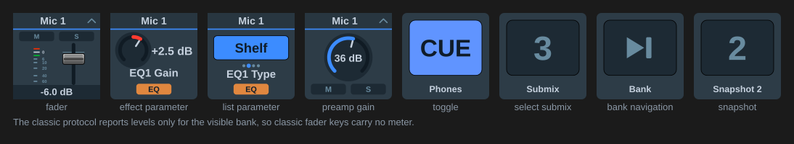

[← Documentation home](../index.md)

# Levels & Parameters (classic)

Levels, pan, preamp gain and effect parameters over classic OSC (TotalMix FX 1.96 to 2.0; also works on 2.1 in classic mode). Key or Stream Deck+ dial. Drawn in the [TotalMix look](../appearance.md): fader strips, knobs and dropdown boxes, with TotalMix's own readout strings as the value.

## Target

| Target | What it controls | Settings |
|---|---|---|
| Main / Control Room volume | The main out | none |
| Volume (strip in current bank) | A fader by its position in the bank TotalMix currently shows | Channel, Bus, Pin bank start |
| Volume (channel) | A channel's fader, selected on page 2 | Channel, Bus, Pin bank start |
| Input gain (preamp) | Preamp gain, inputs only; stereo pairs linked | Channel, Pin bank start, Device |
| Pan (channel) / Pan (strip in current bank) | Balance, `L50 / C / R50` | as above |
| Per channel | FX send (inputs, playbacks), FX return (outputs), Input gain right side (inputs; Device), DURec track | Channel, Bus, Pin bank start |
| EQ | Band 1 type, gain, frequency, Q · Band 2 gain, frequency, Q · Band 3 type, gain, frequency, Q · Low cut frequency and slope | Channel, Bus, Pin bank start |
| Dynamics | Compressor threshold, ratio, attack, release, make-up gain; expander threshold, ratio | Channel, Bus, Pin bank start |
| Auto Level | Maximum gain, headroom, rise speed | Channel, Bus, Pin bank start |
| Room EQ (outputs) | Volume correction, delay, and gain/frequency/Q of all nine bands (type on 1, 8, 9) | Channel, Pin bank start |
| Reverb | Type, volume, pre-delay, width, room scale, smoothness, low cut, high cut; time and high damp (Space); attack, hold, release (Envelope types) | none |
| Echo | Type, volume, delay, feedback, width | none |

*Input gain (preamp)* writes both sides of a stereo pair; *Input gain (right side)* sets the right side alone, stepping in whole dB across the same device gain range.

EQ band types, the low cut slope and the reverb and echo algorithms are lists. A detent or a press moves one entry, and *Set a value* picks the entry by name; the plugin writes its position, scaled over the list the way the classic protocol expects.

*DURec track* is the track this channel takes from a DURec recording: 0 is off, above that the track number, and a stereo channel takes consecutive tracks. TotalMix refuses positions past the end of the recording.

## How the classic protocol addresses channels

TotalMix addresses strips by their position in the currently visible bank, not by a fixed number, so a button follows the bank shown in the mixer. Two settings hold a button on one channel.

*Bus* set to *Leave as is* (strip targets) or *Follow TotalMix's selection* (channel targets) uses the bus TotalMix shows; *Input*, *Playback* or *Output* pins it.

*Pin bank start* is usually 0. With a pinned bus and bank start the plugin steers TotalMix to the right bank before acting.

Stereo pairs count as one channel, and changing a channel between mono and stereo shifts the numbering of everything after it. Set channels to mono/stereo before assigning keys. The Global OSC actions address channels absolutely.

Channels are still picked by name, and the list is read live from the interface for the chosen bus and bank.

## Input gain and the Device setting

Gain steps in whole dB, which needs the width of the preamp's gain range; classic OSC doesn't identify the interface. Pick it under *Device* (shown for both gain targets); unset, a 65 dB span is assumed. A wrong entry only changes how far a detent travels; the displayed number is TotalMix's readout. See [Devices](../devices.md) for the table.

## What the key shows

Faders (main, strip, channel) draw the fader strip with M/S lit from the strip's flags, or from a fader at −∞. There is no meter: classic OSC only reports levels for the visible bank, so a meter would freeze whenever the mixer scrolls. The Global OSC [Volume](../global-osc/volume.md) action has one.

Gain and pan are knobs. Gain fills across TotalMix's full range, pan from the centre.

Effect parameters are knobs whose arc follows the parameter's position, coloured by section, with the section badge lit while the enable is on. For FX send and return the badge lights while the send is above −∞. Selection parameters (EQ and Room EQ band types, low cut slope, reverb and echo algorithms) draw as a dropdown box with TotalMix's name for the entry, and position dots beneath it. Classic OSC sends the entry's name but not its number, so the dots and the *Set a value* list come from the plugin's own copy of the list.

## Stepping, press and touch

As in [Dials and gestures](../dials-and-gestures.md). The classic vocabulary adds *Cue* for strips and channels, and per-strip solo/PFL is inputs and playbacks only. Effect parameters display in TotalMix's own units. dB parameters step in dB once the plugin has seen two readings, frequencies step in Hz, and selections step one entry per detent.
