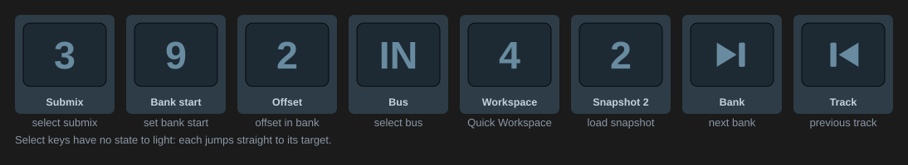

[← Documentation home](../index.md)

# Select (classic)

Navigation and direct selection over classic OSC. Key only.

| Action | Setting | What it does |
|---|---|---|
| Select submix | Index | Selects an output's submix in TotalMix |
| Set bank start / channel | Index | Scrolls the visible bank so the given channel is first |
| Set channel offset in bank | Index | Selects the channel at that offset in the visible bank |
| Select bus | Bus | Switches the visible row: Input, Playback or Output |
| Load Quick Workspace | Index 1 to 30 | Loads a Quick Workspace |
| Load snapshot | Index 1 to 8 | Loads a snapshot |
| Bank navigation | Navigate | Next / previous track, next / previous bank |

These use TotalMix's direct selectors rather than Mackie-style stepping, so a key jumps straight to its target. The keys draw as TotalMix-style buttons with the number or bus on the face and the kind underneath; they have no state and never light. "Icon" in Appearance shows the plugin's stock icon, with the active submix name as the title on submix keys.
