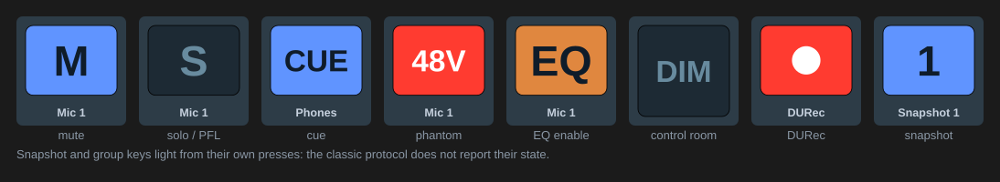

[← Documentation home](../index.md)

# Toggle (classic)

On/off switches over classic OSC. Key only. State is mirrored from TotalMix where it is reported. Drawn as TotalMix-style buttons (blue, orange, red, or orange text for the effect sections) with the strip or channel name underneath. "Icon" in Appearance restores the classic icon pair.

| Group | Parameters | Settings |
|---|---|---|
| Main / Control Room | Dim, Mono, Mute FX return, Speaker B, Talkback, External input, Recall volume | none |
| Global | Mute enable, Solo enable, Trim mode | none |
| Strip in current bank | Mute, Solo / PFL, Phantom power, Cue | Channel, Bus, Pin bank start |
| Channel (the selected channel) | Mute, Solo / PFL, Phantom power, EQ enable, Low cut, Dynamics, Auto Level, Stereo / mono, Phase invert (left / mono), Phase invert (right), Instrument, Pad, M/S processing, AutoSet gain, Loopback, Include in talkback, Exclude from trim, Record enable (DURec) | none |
| DURec transport | Record, Play / pause, Stop | none |
| Groups and snapshots | Mute group, Solo group, Fader group, Snapshot | Number 1 to 8 |
| Effects | Reverb, Echo, Room EQ (outputs) | Channel for Room EQ |

Notes:

- Per-strip Solo/PFL applies to inputs and playbacks only.
- Snapshot and group keys light from their own presses, since TotalMix does not report their state over classic OSC. The Global OSC [Trigger](../global-osc/trigger.md) action lights snapshots from the mixer.
- Bus and bank pinning work as described for [Levels & Parameters](levels.md).

## Hold (momentary)

With **Hold** ticked, the key switches the parameter on while it is held and off when released. Per-strip Mute, Solo, Phantom and Cue carry their value directly, so the press and the release each write one message. The rest are toggles in the classic protocol and only flip on 1.0: the press flips the parameter on if it was off, and the release flips it back only if the press flipped it. Holding one that is already on does nothing at either edge.
