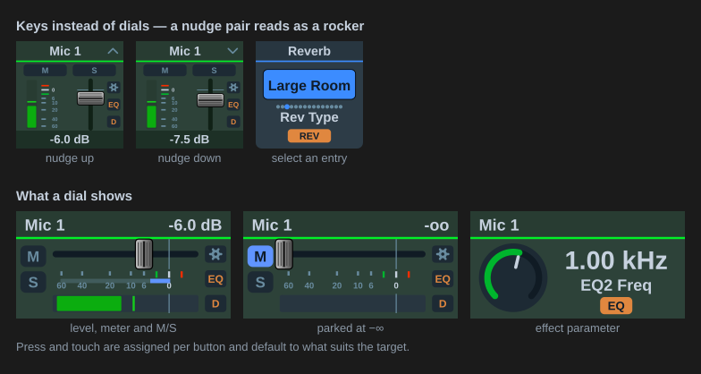

[← Documentation home](index.md)

# Dials and gestures

## Turning

Level controls step in decibels along RME's own fader curve, so a detent moves the same amount whether the fader sits at −40 dB or at unity. The step size is *dB per step* in the button's settings (default 1.5 dB; the default for new buttons can be changed under *Defaults for new buttons*). Preamp gain steps in whole dB. Pan steps 1 % of the throw (two of TotalMix's units), snapped so turning back lands exactly on centre. Effect parameters step in their own unit, see [FX & Dynamics](global-osc/effects.md).

## Keys instead of dials

Every level or parameter action also works on a regular key. Under *Key press* (or *On press* for effects) choose *Nudge up* or *Nudge down*; each press moves by the same step a detent would. A `+` and a `−` key make a volume rocker. The key's header shows a chevron for the direction. List parameters can also *Select an entry* directly, see [select keys](global-osc/effects.md#select-keys).

*Across two keys* draws one strip over a neighbouring pair. Set one key to *Top half* and the key under it to *Bottom half* (or *Left*/*Right* for a side-by-side pair), both on the same channel, and the fader, meter and scale run across both: the strip is laid out at twice the size and each key shows its half. Each key keeps its own press action, so a top/bottom pair is a fader and its own rocker at the same time, with the direction chevron drawn on whichever key it belongs to.

*Next channel* and *Previous channel* are both a key press mode and a dial press or touch gesture. They step the button along a list of channels set under *Advanced: channel cycling*, so four dials can cover sixteen channels. Name a group there and every button using that name steps together, which turns a row of dials into one channel strip. Without a group the channel is stored on the button, so it comes back where you left it. On a dial the target has to be Channel, Input gain or Pan; Main Out and the other control-room targets have no channel to step, so the gesture is not offered there.

*Set the value below* is also available as a dial press or touch gesture, so a dial can jump or fade to a level as well as a key. *Fade over* ramps to the value over a set time instead of jumping, for an end-of-show fade or a timed duck. It interpolates on the fader position, so the move is even from one end of the throw to the other.

*Set a value* writes a fixed value on every press instead of moving by a step: −20 dB on a Dim key, 0 dB on a fader, a track number on a DURec key. The field accepts only the range the parameter allows, and the plugin holds the value to it in case an older button carries something outside. Preamp gain is the one range that depends on the interface, so the field allows the widest preamp span and the plugin clamps to the interface TotalMix reports. A *Set a value* key draws no chevron, since nothing moves. Instead it marks where the value sits: a line across the fader track, a tick outside the knob ring, or a ring around the entry's dot on a list key. The readout keeps showing what the parameter is now, so the marker and the cap read as target and current.

## Press and touch

A Stream Deck+ dial has three inputs: turn it, press it, tap the touch strip above it. Turning always sets the value. Press and touch are assigned per button under *On press* and *On touch*, and default to what suits the target:

| Target | Press | Touch |
|---|---|---|
| Main / Control Room, Speaker B | Mute (fader to −∞) | Dim |
| A Phones slot | Mute | Fader to −∞ |
| A channel, a strip, input gain | Mute | Fader to −∞ (gain to minimum) |
| A submix send (Global OSC) | Solo | Fader to −∞ |
| Pan | Mute (solo for a send's pan) | Centre |
| An effect parameter | Switch the section on/off | Parameter to neutral (0 dB, first list entry, or the middle of the range) |

Either can be reassigned. The menu is grouped by what the choice acts on and only offers what the target supports:

- *This dial*: mute, solo, cue (classic only), phantom power, set to −∞, set to 0 dB, centre the pan, bypass the effect, back to neutral, to neutral and back.
- *Control room*: dim, mono, talkback, speaker B, mute Main Out, external input, mute FX return, recall main volume. These are global switches, so any dial can carry one.
- *Global*: mute all, solo all.
- *Nothing*.

Mute Main Out is the one control-room gesture that is not a plain switch. TotalMix has no control-room mute of its own, so this writes the real output mute of every assigned monitor output. Dim and Recall move the Main Out fader, so a fader-based mute shares that control with them; this one does not.

Setting a fader to −∞ remembers the level it was at, so the next press or tap restores it. It silences the channel without touching its mute, which also leaves any mute group the channel belongs to alone. On the classic actions and on a Global OSC submix send (which has no mute) a fader parked at −∞ is drawn as muted.

## What the display shows

With the [TotalMix look](appearance.md) a dial shows the channel name, the value, the fader position on the real scale, the meter (Global OSC, with level messages enabled) and lit M/S pills. With the icon look it shows name, value and a position bar, and the whole display washes blue for mute and orange for solo.
