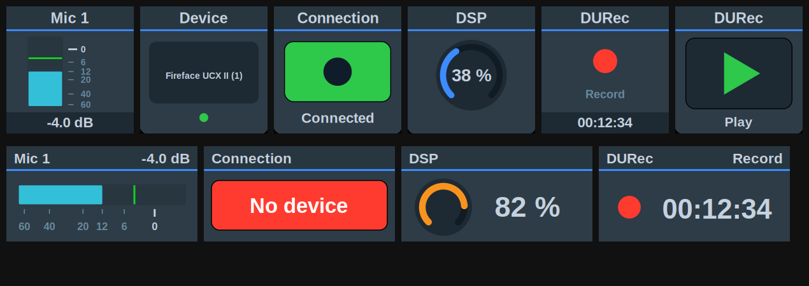

[← Documentation home](../index.md)

# Display (TotalMix 2.1+)

Read-only status over Global OSC, on a key or a dial. Nothing is written; a press or dial push asks TotalMix for a full refresh.

| Show | Source | Panel |
|---|---|---|
| **Channel peak level** | `/level/{bus}/{channel}` — needs *Send Level Messages* on the Global OSC controller | Wide meter on the fader scale, red at 0 dBFS, with a peak-hold line (1.5 s hold, then falling at 12 dB/s). Readout shows the held value. |
| **Device name** | `/status/device` | The name as reported, e.g. "Fireface UCX II (1)" |
| **Device connection** | `/status/connection` | Green "Connected" or red "No device" |
| **DSP load** | `/status/dsp` | Arc gauge, orange past 75 % and red past 90 %. RME doesn't document the unit: a value up to 1 is read as a fraction, above that as a percentage. |
| **DURec time in file** | `/durec/time` | The clock in large digits with the transport symbol from `/durec/state` beside it |
| **DURec transport state** | `/durec/state` | The transport symbol with the state name |

Status data arrives about once a second from TotalMix. The level view repaints at most ten times a second.

## Appearance

"TotalMix panel" (default) draws the panels above. "Plain title" shows the value as the key title, or name, value and bar on the icon-look dial layout.
