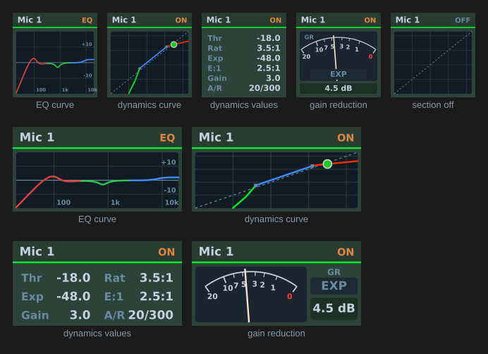

[← Documentation home](../index.md)

# Display (TotalMix 2.1+)

Read-only status over Global OSC, on a key or a dial. Nothing is written; a press or dial push asks TotalMix for a full refresh, or clears a latched alarm.

| Show | What you get | Needs |
|---|---|---|
| Channel peak level | Wide meter on the fader scale (two bars for a stereo pair), red at 0 dBFS, with a peak-hold line (1.5 s hold, then falling at 12 dB/s) and the channel's M and S pills; the S pill follows the channel's PFL button (on a Volume strip it follows the mix-node solo). The readout shows the held value. *Gain reduction* adds TotalMix's blue bar beside the scale, from 0 dB downwards. | Bus, Channel, *Send Level Messages* |
| Clip latch | Lights red and stays lit once the peak reaches the set dBFS, with the highest peak since the last clear. *Blink* flashes it instead of holding it lit. Press to clear. | Bus, Channel, *Send Level Messages* |
| Signal watch | Lights red once the channel has stayed below the floor for the set time, with the seconds counted. Clears itself when signal returns, or on a press. | Bus, Channel, *Send Level Messages* |
| Device name | The name as reported, e.g. "Fireface UCX II (1)" | |
| Device connection | Green "Connected" or red "No device" | |
| DSP load | Arc gauge, orange past 75 % and red past 90 % | |
| DURec time in file | The clock in large digits with the transport symbol beside it | |
| DURec transport state | The transport symbol with the state name | |
| EQ curve | The summed response of the three bands and the low cut, 20 Hz to 20 kHz at ±20 dB, coloured band 1 red, band 2 green, band 3 blue | Bus, Channel |
| Dynamics curve | The section's static response: expansion below the expander threshold, unity between the thresholds, compression above the compressor threshold, offset by the make-up gain | Bus, Channel |
| Dynamics values | The same section as numbers: thresholds, ratios, make-up gain, attack and release | Bus, Channel |
| Dynamics gain reduction | A needle meter of the section's gain reduction, 0 dB at the right stop to 20 dB at the left, with the value beneath | Bus, Channel, *Send Level Messages* |

The level view carries the same *FX lamps* and *Mute / Solo* checkboxes as a [Volume strip](volume.md), for the channel it meters, and both are on by default. The S pill here is the channel's PFL state, not the mix-node solo a Volume strip shows. On a key the two pills pair up on one row when the lamps share the column with them, and with both switched off the meter itself widens into the space; on a Stream Deck+ display the meter takes back whichever column is off.

Status data arrives about once a second from TotalMix. Views carrying a level, meaning the meter, the dynamics curve and the gain-reduction needle, repaint at most ten times a second.

## Channel processing views

On the dynamics curve, the dashed diagonal is the level with the section bypassed, the two small squares are the thresholds, and the dot is the channel's current peak level placed on the curve. Where the response leaves the plot the line stops rather than sliding along the edge.

Attack and release are not drawn on the curve; they appear in the values view.

The gain-reduction bar on the level view and on the Volume strips is TotalMix's own presentation: a blue bar beside the meter, growing down from the 0 dB mark by the compressor's reduction, on the fader curve so 6 dB of reduction reaches the 6 mark. The expander's attenuation continues the bar in green below the blue part. A dark track marks the bar's span whenever the dynamics section is on, so a resting bar reads as "no reduction" rather than "not drawn". Auto Level's gain, which TotalMix draws above the mark, is not shown, because nothing in the protocol carries it.

The gain-reduction needle shows the compressor's reduction on a logarithmic 0 to 20 dB scale like a VU-type GR meter, with an EXP lamp that lights green while the expander is working.

### Accuracy of the reduction readings

TotalMix sends no gain-reduction value, so the bar, the needle and the curve dot are computed from the reported peak level and the dynamics settings (static curve, attack and release modelled as first-order lags, fitted against captured probe runs). They are an estimate limited by the level message rate and the Stream Deck redraw rate, not TotalMix's own value.

The EQ curve is likewise computed from the reported gain, frequency, Q and band type. TotalMix does not report the sample rate, so 48 kHz is assumed; the difference is invisible below a few kHz and amounts to a fraction of a dB approaching 20 kHz at other rates.

## Appearance

"TotalMix panel" (default) draws the panels above. "Plain title" shows the value as the key title, or name, value and bar on the icon-look dial layout.

The alarms draw their own face, so they have no appearance setting. Levels are only sent while *Send Level Messages* is on for the Global OSC controller, and only when they change, so a channel that falls silent stops reporting. The signal watch therefore counts on the clock rather than on arrivals, and both alarms read "—" until the first level arrives.

## Spread across several keys

*Advanced: spread across several keys* lays one panel over a block, up to 9 across and 4 down; 1 x 1 is a single key and is the default. Put the same button on every key of the block and set the same span on each: a key works out its own share from its coordinates, so nothing is configured per key. *Top-left column* and *Top-left row* say where the block starts, counting from 1 (the top-left key of the device is column 1, row 1); a key outside the block keeps its single-key artwork.

The EQ curve is redrawn at the block's full size. The other panels are magnified rather than redrawn, since their layout is fixed to one key. The artwork is continuous; the bezels between keys interrupt it.
