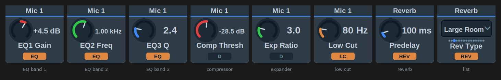
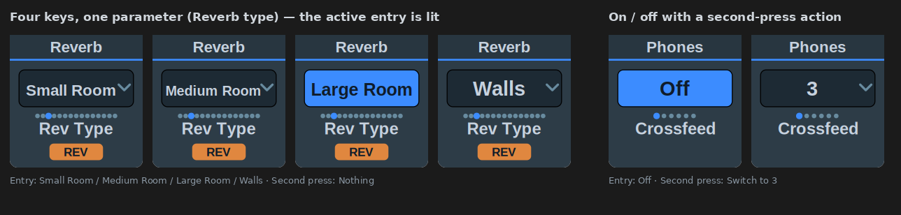

[← Documentation home](../index.md)

# Effects & Dynamics (TotalMix 2.1+)

Effect, EQ, dynamics, Auto Level, Room EQ, reverb and echo parameters over Global OSC, by absolute channel number. Key or Stream Deck+ dial. Each parameter steps in its own unit.

## Parameters

| Group | Parameters | Bus |
|---|---|---|
| **FX send and return** | FX Send (inputs, playbacks), FX Return (outputs) | per channel |
| **EQ** | Band 1 type, gain, frequency, Q · Band 2 gain, frequency, Q · Band 3 type, gain, frequency, Q | any |
| **Low cut** | Frequency, Slope (6 / 12 / 18 / 24 dB/oct) | any |
| **Dynamics** | Make-up gain, Attack, Release, Compressor threshold and ratio, Expander threshold and ratio | any |
| **Auto Level** | Max gain, Headroom, Rise time | any |
| **Channel** | Width (inputs, playbacks) · Crossfeed (outputs; Off, 1–5) · Delay (outputs; left and right separately) · Reference level (line inputs and outputs; list depends on the interface, see [Devices](../devices.md)) | as listed |
| **Room EQ** | Volume correction, Delay, and gain/frequency/Q of all nine bands (type on bands 1, 8, 9); left and right separately | outputs |
| **Reverb** | Type, Volume, Pre-delay, Low cut, High cut, Room scale, Smoothness, Width; Time and High damp (Space type); Attack, Hold, Release (Envelope types) | — |
| **Echo** | Type, Volume, Delay, Feedback, High cut, Width | — |

Where a parameter exists on one bus only, the bus picker is hidden and that bus is written. Where it exists on two, the third is not offered. Reference level applies to line inputs and outputs; mic and instrument inputs have no level switch, and TotalMix ignores a write to a channel that lacks one.

## Steps

The step per detent or press is set in the parameter's own unit, one slider per unit type:

| Unit | Setting | Default |
|---|---|---|
| dB (gains, thresholds, levels) | dB per step | 1 dB |
| Hz (frequencies) | Hz per step | 20 Hz |
| List entries (types, slopes, crossfeed, reference level) | Positions per step | 1 |
| Fine values (width, room scale) | Units per step | 0.05 |
| Tenths (Q, ratios, rise time) | Units per step | 0.1 |
| Whole numbers (ms, %) | Units per step | 1 |
| Coarse (release) | Units per step | 10 |

Frequencies are clamped to 20 Hz – 20 kHz; list parameters stop at the ends of their list; everything else is clamped by TotalMix.

## Press and touch

Default: press switches the parameter's section on or off (EQ, low cut, dynamics, Auto Level, Room EQ, reverb, echo), touch parks the value at its default and brings it back — 0 dB for gains and levels, the first entry of a list, the middle of a range, and for Room EQ the values its panel opens on. Both are reassignable; see [Dials and gestures](../dials-and-gestures.md).

Parameters that are always in circuit (width, crossfeed, delay, reference level, FX send/return) have no section to switch; their press does nothing unless you assign something.

## On the key or display

A knob with the arc in the section's colour — EQ band 1 red, band 2 green, band 3 blue, compressor red, expander green, low cut orange, everything else blue. Centre-zero parameters (gains, width) fill from the middle. Value beside the knob, parameter name underneath, and a badge (EQ, LC, D, AL, FX, REQ, REV, ECHO) that lights orange while the section is on. The arc uses display ranges where RME's table publishes none; a wrong range only affects the arc, never the value written.

List parameters draw as a dropdown box with the entry name and position dots.

## Select keys

For a list parameter, a key can write one specific entry instead of stepping. Set **On press** to *Select an entry*; two settings appear:

- **Entry** — what a press writes. The list comes from the plugin (for reference level: from the reported interface, per bus).
- **Second press** — what a press does while the key is lit, i.e. its entry is the active one: *Nothing*, *Back to the previous entry*, or *Switch to …* another entry.

The key shows its entry and lights while that entry is active, so a row of keys reads like the menu with the current item highlighted. Examples:

- Four keys with four reverb types, second press *Nothing* — a preset row.
- Crossfeed "Off" with *Switch to 3* — an on/off key.
- "Large Room" with *Back to the previous entry* — a momentary override.

"Previous" is remembered per parameter, so it works across keys; with nothing remembered (first press after startup) the key stays put.

## Notes

- Reference level, crossfeed and the other channel parameters are on the *Effects & Dynamics* action because they step like effect parameters, not because they are effects.
- Send and return levels and the reverb/echo volumes follow the fader curve; "-oo" means TotalMix reported an under-range value.
