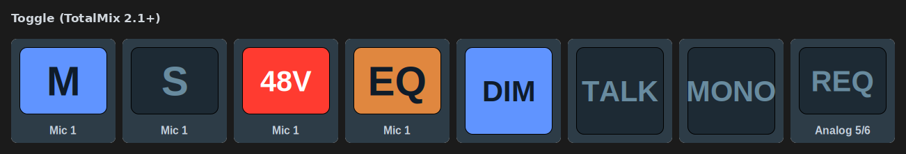

[← Documentation home](../index.md)

# Toggle (TotalMix 2.1+)

On/off switches over Global OSC. Key only. The key's state is the mixer's: a press sends the inverse of what TotalMix last reported, and a change made in TotalMix (or anywhere else) updates the key.

## Parameters

| Group | Parameters | Settings |
|---|---|---|
| **Control Room** | Dim, Mono, Talkback, External input, Speaker B, Mute FX return, Link Main/Speaker B | — |
| **Global** | Mute enable, Solo enable | — |
| **Channel** | Mute, PFL, Phase (L/R separate), Phantom power (48V), Instrument, Pad, AutoSet, M/S processing, Loopback, Stereo link, Record enable | Bus, Channel |
| **Channel processing** | Low cut, EQ, Dynamics, AutoLevel, Room EQ | Bus, Channel |
| **Effects** | Reverb, Echo | — |
| **Groups** | Mute group, Solo group, Fader group | Group number 1–4 |

- Phantom power, Instrument, Pad and AutoSet exist on inputs only; Room EQ on outputs only. The bus picker is hidden for those and the right bus is written regardless of what an older key had stored.
- Phase is separate per side on stereo pairs: the channel list offers "(R)" entries for the right side.
- **Groups** are receive-only in RME's protocol — TotalMix never reports their state — so a group key tracks its own presses and cannot see changes made in the window.

## Appearance

The [TotalMix look](../appearance.md) draws a TotalMix-style button lit in the parameter's colour with the channel name underneath. "Icon" uses the classic on/off icon pair.
