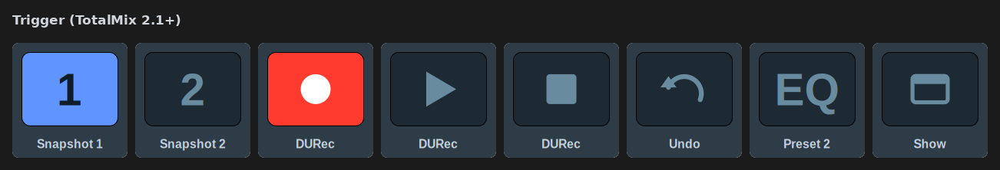

[← Documentation home](../index.md)

# Trigger (TotalMix 2.1+)

One-shot commands over Global OSC. Key only.

| Group | Actions | Settings |
|---|---|---|
| **Snapshots and layouts** | Load snapshot 1–8, Load layout preset | Snapshot / Layout number |
| **Presets** | Load EQ preset (channel), Load dynamics preset (channel), Load Room EQ preset (output), Load reverb preset, Load echo preset | Preset number; Bus and Channel for the per-channel ones |
| **Mixer** | Undo, Redo, Recall volume | — |
| **DURec** | Play, Pause, Stop, Record, Next, Previous | — |
| **Window** | Show TotalMix window, Hide TotalMix window | — |

## State

- **Snapshots** light while loaded. TotalMix reports the load state over Global OSC (0 off, 2 active, 3 active but changed), including loads made in the mixer window — something the classic protocol cannot do.
- **DURec** keys light from `/durec/state`: record red while recording, play green while playing, pause and stop accordingly.
- Everything else is stateless and stays unlit.

## Notes

- **DURec Stop** during a recording needs two presses. That is TotalMix's own protection against killing a take; the plugin does not bypass it.
- Snapshot *save* is listed in RME's table but marked as not implemented, so it is not offered.

## Appearance

Snapshots and layouts show their number on the face; presets show their section; DURec, undo/redo and show/hide use symbols. "Icon" restores the classic artwork.
