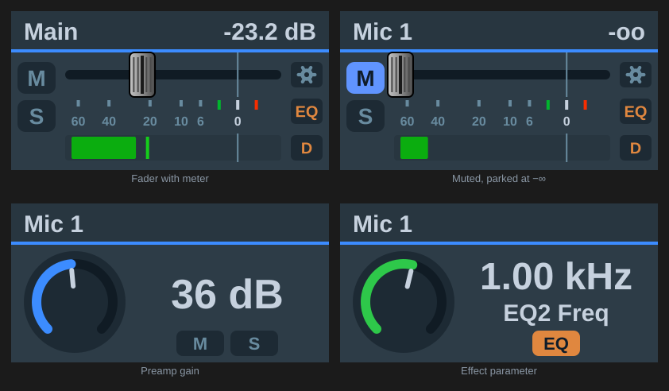

[← Documentation home](../index.md)

# Volume (TotalMix 2.1+)

Level, pan and preamp gain over Global OSC, addressed by absolute channel number. Key or Stream Deck+ dial.

## Target

| Target | What it controls | Settings |
|---|---|---|
| **Main Out (Control Room)** | The output channel TotalMix has assigned as Main Out. Follows the assignment if it changes. | — |
| **Active Monitor (Main / Speaker B)** | Main Out while Speaker B is off, or Main Out B while Speaker B is on. Follows both assignments and Speaker B changes made by TotalMix, ARC USB, Stream Deck or another Global OSC controller. | — |
| **Channel fader** | A channel's fader. For output channels this is the channel's own fader. For input and playback channels it is the send into a submix — see below. | Bus, Channel, Submix |
| **Submix send (mix node)** | One node of the mix matrix: the level of a source into an output's submix. | Source bus, Source channel, To output |
| **Input gain (preamp)** | Preamp gain of an input channel, in whole dB, with the ceiling read from the reported device (see [Devices](../devices.md)). Linked stereo pairs move together. Channels without a preamp show 0 and ignore the dial. | Channel |
| **Pan (channel)** | A channel's balance, `L50 / C / R50`. | Bus, Channel |
| **Pan (submix send)** | The balance of one mix node. | Source bus, Source channel, To output |

### Input and playback faders are per-submix

In TotalMix an input strip's fader is its send into the submix currently selected in the window, so over Global OSC these levels live on the mix matrix, one per output. A *Channel fader* on an input or playback channel therefore has a **Submix** picker: *Main Out (auto)* follows the control room's Main Out assignment, or pin any output's submix. The fader you see in the TotalMix window only moves while that submix is selected there; the audio changes either way. Output channels have one real fader and no picker.

TotalMix's *Follow Submix* option should be off when using the Global OSC actions.

### Channels

Channels are chosen by name — the list shows what TotalMix calls them ("5 · Analog 5/6"), read from the interface. Stereo pairs are addressed by their left channel. The list reloads when you change the bus or target; the refresh button next to it re-reads the names on demand (after renaming a channel in TotalMix, for example).

## Stepping, press and touch

See [Dials and gestures](../dials-and-gestures.md). Defaults here: press mutes (Main Out and Active Monitor: fader to −∞; a submix send: solo), touch parks the fader at −∞ (Main Out and Active Monitor: dim; pan: centre).

Global OSC has no cue in its channel section, so *Cue* is not offered; a mix node has no mute of its own, so its press defaults to solo.

**Mute Main Out** is a separate ARC USB-style Control Room gesture. It reads Main Out's real output mute, inverts it, then writes that same state to the outputs currently assigned to Main Out and Main Out B. Speaker B does not choose the operation target, and Main Out alone remains the displayed state source. This does not replace **This dial → Mute**, which continues to park the controlled fader at −∞ and restore it.

## On the key or display

With the [TotalMix look](../appearance.md): a fader strip with meter and peak hold, or a knob for gain and pan. Keys show a chevron for their nudge direction.

When the target is **Active Monitor** and either gesture is **Mute Main Out**, the display also follows Main Out's real mute state. The TotalMix look lights its blue **M** pill; the Icon look shows a red rounded **M** badge beside the dB readout. No other target or mute gesture uses this indicator.

## Notes

- Levels are read in whichever form TotalMix transmits (linear fader value or dB) and written back in that form, so *Send faders in linear scale* can be on or off.
- A channel fader that TotalMix has not reported yet starts stepping from −∞ rather than ignoring the move.
