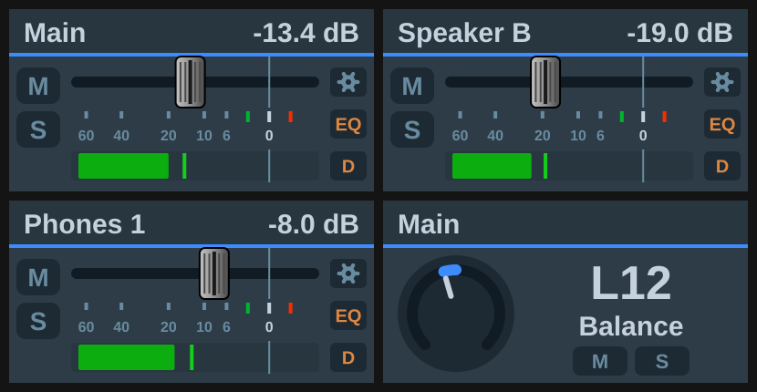

[← Documentation home](../index.md)

# Volume (TotalMix 2.1+)

Level, pan and preamp gain over Global OSC, addressed by absolute channel number. Key or Stream Deck+ dial.

## Target

| Target | What it controls | Settings |
|---|---|---|
| Main Out (Control Room) | The output channel TotalMix has assigned as Main Out. Follows the assignment if it changes. | Follow the active speaker |
| Speaker B (Control Room) | The output assigned as Main Out B, whether or not Speaker B is switched on. | none |
| Phones (Control Room) | The output assigned to a Phones slot. Follows that assignment the way Main Out follows its own. | Phones slot 1 to 4 |
| Follow the monitor path (Control Room) | Main Out, Speaker B or a Phones slot, whichever the *Monitor path: step through slots* [Trigger](trigger.md) key last selected. | none |
| Balance (Control Room) | The balance of the output assigned to Main Out, Speaker B, a Phones slot, or the slot the monitor path currently names. | Monitor, Phones slot |
| Channel fader | A channel's fader. For output channels this is the channel's own fader. For input and playback channels it is the send into a submix, see below. | Bus, Channel, Submix |
| Submix send (mix node) | One node of the mix matrix: the level of a source into an output's submix. | Source bus, Source channel, To output |
| Input gain (preamp) | Preamp gain of an input channel, in whole dB, with the ceiling read from the reported device (see [Devices](../devices.md)). Linked stereo pairs move together. Channels without a preamp show 0 and ignore the dial. | Channel |
| Pan (channel) | A channel's balance, `L50 / C / R50`. | Bus, Channel |
| Pan (submix send) | The balance of one mix node. | Source bus, Source channel, To output |

### Control room targets

Each of these follows TotalMix's own assignment, so a dial keeps working after you reassign a monitor. An unassigned slot draws offline and reads "No Spk B" or "No Ph n". A Speaker B dial addresses Main Out B whether or not Speaker B is engaged, and draws inactive while it is off; the level is still real and still settable. Engaging Speaker B does not move the Main Out assignment, so tick *Follow the active speaker* if you want a Main Out dial to hand over to B while B is on.

Main Out and Speaker B press to mute (fader to −∞) and touch to dim. A Phones slot resolves to an ordinary output channel, so it uses that channel's real mute and the channel gesture defaults; dim acts on the control room and never reaches it.

### Input and playback faders are per-submix

In TotalMix an input strip's fader is its send into the submix currently selected in the window, so over Global OSC these levels live on the mix matrix, one per output. A *Channel fader* on an input or playback channel therefore has a *Submix* picker. *Main Out (auto)* follows the control room's Main Out assignment, or you can pin any output's submix. The fader you see in the TotalMix window only moves while that submix is selected there; the audio changes either way. Output channels have one real fader and no picker.

TotalMix's *Follow Submix* option should be off when using the Global OSC actions.

### Channels

Channels are chosen by name. The list shows what TotalMix calls them ("5 · Analog 5/6"), read from the interface. Stereo pairs are addressed by their left channel. The list reloads when you change the bus or target; the refresh button next to it re-reads the names on demand, after renaming a channel in TotalMix for example.

## Stepping, press and touch

See [Dials and gestures](../dials-and-gestures.md). Defaults here: press mutes (Main Out: fader to −∞; a submix send: solo), touch parks the fader at −∞ (Main Out: dim; pan: centre).

Global OSC has no cue in its channel section, so *Cue* is not offered. A mix node has no mute of its own, so its press defaults to solo. Solo on an input or playback strip is the solo of its node into the strip's submix, which is where the protocol carries it; an output has no solo.

*Mute Main Out* is a control-room gesture available on any dial. TotalMix has no control-room mute of its own, so it writes the real output mute of every assigned monitor output and reads Main Out for its state. It exists alongside *Set to −∞* because Dim and Recall move that fader too.

## On the key or display

With the [TotalMix look](../appearance.md) a level draws a fader strip with meter and peak hold; gain and pan draw a knob. Keys show a chevron for their nudge direction.

*Gain reduction* draws TotalMix's blue bar beside the meter for the metered channel's compressor (a mix node meters its source), continued in green by the expander. It needs the meter, and is computed from the level and the channel's dynamics settings rather than measured, see [Display](display.md#channel-processing-views).

*FX lamps* draws TotalMix's indicators beside the fader, for the channel the meter follows:

| Lamp | Lit by |
|---|---|
| EQ | EQ section or low cut |
| Dynamics | compressor/expander or Auto Level |
| Settings (gear) | in/pb: MS processing or phase — out: crossfeed, phase, Room EQ or loopback |

Playback channels have the gear alone. The lamps are read-only, so a key that only needs to *see* EQ and dynamics state no longer needs a Toggle key each.

Output strips carry a fourth lamp, **REQ**, lit while that output's Room EQ is on. TotalMix does not draw one; the section's state is otherwise only visible inside the settings panel.

*Mute look* (fader targets only; gain and pan knobs have no mute treatment) decides how a cut strip is drawn: *Subtle* lights the M pill blue, as TotalMix does. *Red badge* lights the same pill red. *Red badge and cross* adds a red cross over the strip. *Red badge and cast* adds a translucent red below the header band instead. *Red cast and cross* has both.

A submix send has no mute in Global OSC, so a send at the bottom of its throw counts as cut too: the pill reads `-oo` and takes whichever treatment is set. Every step can be chosen per button, or for new buttons under *Defaults for new buttons*.

*Mute / Solo* draws the M and S pills. Both are on by default, and either one switched off hands its room to the fader: on a display the travel grows towards that edge, on a key the strip grows into the space the pills held. Without the pills the strip shows no mute or solo state at all.

## Notes

- Works with TotalMix's *Send faders in linear scale* on or off.
- A channel fader that TotalMix has not reported yet starts stepping from −∞ rather than ignoring the move.
