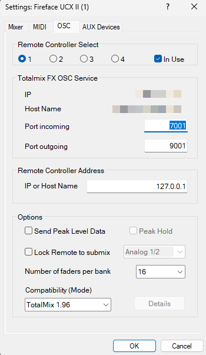
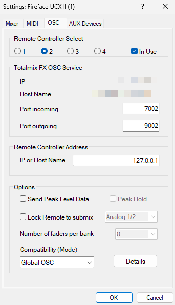
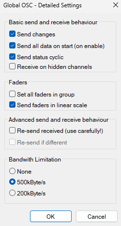
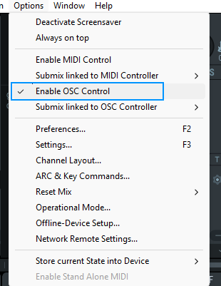
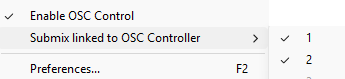

[← Documentation home](index.md)

# Setup

After installing, the plugin's actions appear in Stream Deck's action list under *TotalMix FX Control*. The plugin talks to TotalMix over OSC, which has to be switched on in TotalMix's settings.

TotalMix offers four *Remote Controllers*; the plugin uses one per protocol:

| | Remote Controller | Mode | Ports (incoming / outgoing) |
|---|---|---|---|
| Classic actions | 1 | classic (default) | 7001 / 9001 |
| Global OSC actions "(TotalMix 2.1+)" | 2 | Global OSC | 7002 / 9002 |

Set up whichever family you intend to use, both only if you want both. Open *Options → Settings… → OSC* in TotalMix.

## Global OSC (TotalMix FX 2.1+)

1. Tick *In Use* on Remote Controller 2.
2. Enter `127.0.0.1` in *Remote Controller Address*. That means "this computer"; if Stream Deck runs on a different machine, enter that machine's IP address instead.
3. Leave the ports at incoming 7002 / outgoing 9002, which are the plugin's defaults.
4. Set *Compatibility (Mode)* to *Global OSC*.
5. Click *Details* and enable at least *Send changes* and *Send status*. *Send faders in linear scale* and *Send all data on start (enable)* are supported and recommended.
6. Tick *Send Level Messages* for peak meters on the fader strips and the Display action; without it, the meters stay empty.

 

## Classic OSC (TotalMix FX 1.96 to 2.0, or the classic actions)

1. Tick *In Use* on Remote Controller 1.
2. Enter `127.0.0.1` (or the Stream Deck machine's IP) in *Remote Controller Address*.
3. Leave the ports at incoming 7001 / outgoing 9001.
4. Set *Number of faders per bank* to your interface's channel count. The plugin can only read as many channels as this allows.
5. Leave *Send Level Messages* off, the classic actions don't use meters.

 

## Finish, for either

- Tick *Enable OSC Control* in TotalMix's *Options* menu.
- Make sure *Submix linked to OSC Controller* is ticked for every Remote Controller that is *In Use*.
- When Windows or macOS asks whether TotalMix and the Stream Deck plugin may use the network, allow it. A blocked firewall prompt is the most common reason for "nothing happens".

No additional software is needed.

## If your ports or host are different

Every button carries its own connection settings under *Connection* in its settings panel (the panel on the right when the key is selected in Stream Deck). Open any action's settings and expand *Defaults for new buttons*. Host, ports and dB-per-step set there are copied into each button as you add it. They live in Stream Deck's own storage, so they survive plugin updates.

- Changing a default does not move buttons already on your deck; they keep the connection they were created with, so buttons on different Remote Controllers can coexist.
- The classic and the Global OSC actions keep separate defaults, because they address separate controllers.
- TotalMix can run on another computer: set its IP address as the host and allow the connection through any firewall in between.
- Every Remote Controller needs its own pair of ports. The plugin listens on the controller's *outgoing* port; if two buttons name the same outgoing port for different controllers, say both 9001, the plugin logs a "port already in use" message naming the port. TotalMix itself listens on the *incoming* port, which must also differ between controllers.

## Using both plugins (coming from v3)

Stream Deck treats this as a separate plugin from v3, so both install side by side, but they cannot share Remote Controllers. v3 uses controllers 1 and 2, and so does this one. If you want both active, move one to controller 3 or 4 and set the ports accordingly under *Connection* or *Defaults for new buttons*. Otherwise uninstall v3.

Buttons from v3 do not carry over. MIDI is gone, since OSC does everything it did and reports state back, so stay on 3.3.5 if you depend on it. The `de.shells.totalmix.exe.config` file is gone too, connection settings are per button now.
